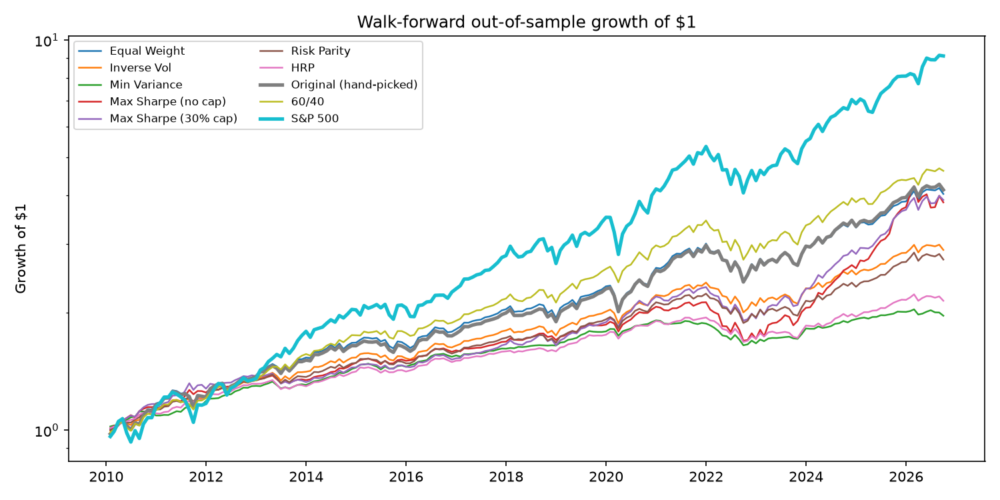
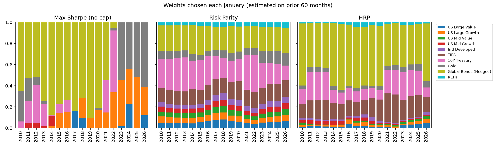

# Did Intuition Beat the Optimizer?
### Out-of-sample testing of a discretionary 10-asset foundation portfolio

This project starts from a portfolio my team designed by judgment for a UC Berkeley course (UGBA 133, Investments). The fund is a hypothetical $75M perpetual foundation with a ~7% target return (5% payout + 2% inflation). I rebuilt the backtest in Python and then asked a quant question: **would a systematic allocation rule, estimated only on past data, have done better than our hand-picked weights?**

> The original asset allocation (midterm and final reports) was a four-person group project. Everything in this repo (replication, walk-forward framework, optimizers, statistical tests, stress/factor analysis, Monte Carlo) is my individual extension of it, built with AI coding assistance.

## Key findings

1. **The replication matches.** On 252 overlapping months, the Python backtest has a 0.999 monthly correlation with the Portfolio Visualizer report used in class (Sharpe 0.66 vs 0.68).
2. **No method reliably beats the hand-picked weights.** Over 2010–2026 out-of-sample, the long-only max-Sharpe portfolio with a 30% cap had the highest Sharpe (0.93 vs 0.78). But the 95% block-bootstrap confidence interval for the Sharpe difference is [−0.24, +0.51]. None of the seven rules has an interval that excludes zero. Two things make the 0.93 look better than it is. It is the best of 7 rules. And 60 months, the window used in the main table, is the best of the three windows I tried for this rule (36 / 60 / 120 months give 0.71 / 0.82 / 0.79 on the 2015–2026 sample).
3. **MVO without a weight cap behaves the way the textbooks warn.** From 2010 to 2021 it put 52–91% in global bonds each year. From 2023 it held 0% bonds and 44–61% gold. Changing only the estimation window (2015–2026 sample) moves its Sharpe from 0.60 to 0.70 to 0.79.
4. **The two lowest-risk rules flipped from best to worst.** I picked these sub-period splits after seeing 2022, so this is a description, not a test.
   - Min-variance had the highest 2010–2021 Sharpe of any strategy (1.44). It entered 2022 with 97% in bonds and TIPS, lost 11.0% that year, and has had a Sharpe of −0.01 since 2023.
   - HRP had 1.42 in 2010–2021. It entered 2022 with 90% in bonds and TIPS, lost 11.7%, and has had a Sharpe of 0.29 since 2023.
   - For comparison, equal weight had 1.02, lost 14.0% in 2022, and has had 0.81 since 2023, while running at more than twice their volatility over the full period (9.7% vs 3.9% and 4.6%).
5. **The portfolio's "downside protection" story does not hold up.** The original write-up said the allocation provides strong downside protection. In the GFC (−32.7% vs −26.9%), the 2011 Euro crisis (−9.1% vs −5.3%) and the COVID crash (−13.1% vs −8.8%), it lost **more** than a plain 60/40. Splitting the portfolio in two shows that both halves were weaker. The equity-like 60% fell a bit more than the S&P 500 (GFC: −54.6% vs −51.0%). The defensive 40% (TIPS, gold, global bonds, Treasuries) gained much less than Treasuries alone (GFC: +9.4% vs +17.1%; COVID: +0.4% vs +6.8%). The defensive half accounts for more of the gap: in the GFC it explains 3.1 points of the 5.8-point shortfall vs 60/40, and the equity half explains 2.2 (buy-and-hold approximation inside the window). The portfolio only beat 60/40 slightly in Q4 2018 and in 2022.
6. **The ±5% rebalancing band never fired.** The report proposed annual rebalancing plus a ±5% drift trigger. Over Dec 2004–Sep 2026, no sleeve drifted 5% between annual rebalances, so "annual + band" gives exactly the same result as "annual". Across all five rules I tested, Sharpe varies by less than 0.03 (0.629–0.657).
7. **The returns are factor beta, and there is no clear alpha.** With equity factors (Fama–French 5 + momentum) plus a duration factor and a gold factor, alpha is −1.2% a year (t = −2.9) and R² is 0.96. But that model has no factor for international equity, REITs or TIPS, which are 35% of the weight. Adding those three brings alpha to −0.2% (t = −1.5), which is not significant, and R² to 0.995. The high R² is partly mechanical, because the duration and gold factors are built from two of the portfolio's own holdings (IEF and GLD).
8. **5% payout is hard to sustain.** In 10,000 bootstrapped 50-year paths, the original portfolio keeps its real value 61% of the time, about the same as 60/40 (64%).

## Out-of-sample results (2010-01 to 2026-09, 10bp trading costs)

Each January, weights are estimated using only the previous 60 months, then held for the year. Max drawdown is measured on month-end values, so intramonth losses were larger.

| Strategy | CAGR | Vol | Sharpe | Max DD | Turnover/yr |
|:--|--:|--:|--:|--:|--:|
| Max Sharpe (30% cap) | 8.5% | 7.6% | 0.93 | −18.0% | 17% |
| 60/40 | 9.6% | 8.8% | 0.92 | −20.6% | 3% |
| S&P 500 | 14.1% | 14.4% | 0.89 | −24.0% | 0% |
| Max Sharpe (no cap) | 8.4% | 8.2% | 0.86 | −20.3% | 22% |
| Inverse Vol | 6.6% | 6.5% | 0.78 | −16.1% | 4% |
| **Original (hand-picked)** | **8.8%** | **9.6%** | **0.78** | **−19.5%** | **4%** |
| Risk Parity | 6.2% | 6.1% | 0.78 | −15.9% | 5% |
| Equal Weight | 8.7% | 9.7% | 0.76 | −19.6% | 4% |
| HRP | 4.7% | 4.6% | 0.69 | −13.4% | 8% |
| Min Variance | 4.1% | 3.9% | 0.68 | −13.7% | 8% |




## Caveats about the comparison

- **The original weights have look-ahead bias.** They were chosen in late 2025 by people who had already seen the 2001–2025 returns, so their "out-of-sample" row is not truly out of sample.
- **The asset menu is shared hindsight.** The 10 assets, including gold, were also chosen in 2025, and every systematic rule optimizes over that same menu. Only the rules' weights are out of sample. Removing gold from the menu lowers six of the seven rules' Sharpe ratios by 0.04 to 0.11 (30% cap: 0.927 → 0.815). Min-variance never held gold, so it is unchanged.

## Method

| Step | Script | What it does |
|:--|:--|:--|
| Tests | `tests/` | Look-ahead tests: scramble all data (or all targets) after a cut date with noise and check that nothing before the cut changes. Optimizer tests: min-variance meets its optimality (KKT) conditions, and risk parity has equal risk contributions |
| Proxy check | `src/00_proxy_check.py` | Monthly correlation of PFORX and BNDX since 2013 |
| Data | `src/data.py` | ETF and mutual-fund prices via yfinance, monthly total returns to Sep 2026, 13-week T-bill as risk-free |
| Shared logic | `src/strategies.py` | The 7 rules, the walk-forward loop and the 60/40 benchmark, imported by every script and test |
| 1. Replication | `src/01_replicate.py` | Rebuild the course backtest and compare it month by month with Portfolio Visualizer (`src/extract_pv_report.py` shows how the PV numbers were taken from the report PDF) |
| 2–3. Walk-forward | `src/02_walkforward.py` | 7 allocation rules, annual re-estimation on a rolling 60-month window, 10bp costs (including the initial build) |
| 4. Significance | `src/03_significance.py` | 12-month moving-block bootstrap CI on Sharpe differences, window sensitivity, rebalancing rules, menu without gold |
| 5. Stress + factors | `src/04_stress_factors.py` | Returns in 6 crisis windows, split into equity and defensive halves; two factor regressions with Newey–West (HAC, 6 lags) errors |
| 6. Foundation sim | `src/05_foundation_sim.py` | 10,000 × 50-year paths, joint (return, CPI) 12-month block bootstrap, 5% payout |

Allocation rules (`src/optimizers.py`): equal weight, inverse volatility, minimum variance, max Sharpe (Markowitz on excess returns, with and without a 30% cap), equal-risk-contribution risk parity, and Hierarchical Risk Parity (López de Prado, 2016). All are long-only and fully invested.

**Asset proxies:** IVE, IVW, IJJ, IJK (US large/mid value/growth), EFA, TIP, IEF, GLD, VNQ, and the PFORX mutual fund for USD-hedged global bonds (BNDX starts only in 2013; the two have a 0.93 monthly correlation over the overlap). The common sample starts in Dec 2004 because GLD launched then. The benchmark is the VFINX mutual fund.

## Limitations

- Only ~22 years of data, and one dominant regime (strong US equities, falling rates until 2021). Every bootstrap result assumes the future resamples this past. The S&P 500 numbers in the 50-year simulation are optimistic for exactly this reason.
- Mean returns are estimated from trailing sample averages, which are a very noisy input for MVO. Shrinkage estimators or Black–Litterman are natural next steps.
- ETF expense ratios are inside the returns. Taxes and market impact are ignored.
- Two risk-free rates are used. Sharpe ratios use the average 13-week T-bill yield during each month. The factor regressions use Fama–French's 1-month T-bill, to match the factors.
- The stress windows are well-known episode dates I picked by hand, not derived from the data. Only the GFC window matches the drawdown dates in the course report.
- The October 2025 CPI was never published (government shutdown), so the simulation drops Oct and Nov 2025 instead of guessing them. Carrying the September CPI forward instead (`python src/05_foundation_sim.py --ffill-cpi`) moves the original portfolio's P(real value kept) from 61% to 63%. Treat the simulation numbers as accurate only to a few points.

## Run it

```bash
pip install -r requirements.txt
python -m pytest tests
python src/01_replicate.py
python src/02_walkforward.py
python src/03_significance.py
python src/04_stress_factors.py
python src/05_foundation_sim.py
```

Run everything from the repo root. `python src/data.py` re-downloads prices (to Sep 2026). Fama–French factors are from Ken French's data library, and CPI is FRED `CPIAUCSL`.
